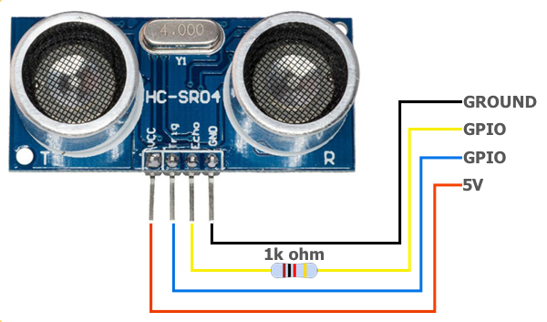

# MMM-Gpio
This is an extension for the [MagicMirror](https://github.com/MichMich/MagicMirror). 

It can add GPio functionality to the Magic Mirror whithout having to start the mirror using sudo.
Initial there is support for two HC-SR04 sensors, using them as touchless buttons. 
The buttons are used to select pages on you mirror.

Wiring the Sensors



## GpioService
Controlling the GPio is done by a seperate service GPioService. This service has a REST interface and can send notification to the mirror.
This service is started from the MMM-Gpio node_helper.js and it will run as sudo

#### GpioService dependencies 
- [express](https://www.npmjs.com/package/express)
- [onoff](https://www.npmjs.com/package/onoff)

both installed by `npm install` in the GpioService subdirectory 


## MMM-Gpio dependencies
You should have the following modules installed and configured whith your mirror

- [MMM-Remote-Control](https://github.com/Jopyth/MMM-Remote-Control)
- [MMM-pages](https://github.com/edward-shen/MMM-pages)
- [MMM-page-indicator](https://github.com/edward-shen/MMM-page-indicator)


GpioService will be started as child process using:
- [child_process](https://nodejs.org/api/child_process.html)


## Installation
1. Navigate into your MagicMirror's `modules`  
2. `git clone https://github.com/ReneHeuker/MMM-Gpio.git`
3. installing GpioService
- `cd <module-path>/MMM-Gpio/GpioService`
- `npm install`
4. installing module
- `cd <module-path>/MMM-Gpio`
- `npm install` 

## Using the module
First of all connect he sensors to the correct pins on the pi Raspberry PI. 
To use this module, add it to the modules array in the `config/config.js` file:
````javascript
modules: [
  {
    module: "MMM-Gpio",
    config: {
      debug: false,
      sensors: [
        {
          triggerPin: 25,
          echoPin: 26
        },
        {
          triggerPin: 23,
          echoPin: 24
        }
      ] 
    } 
  },
]
````
default configuration, can all be overridden in `config.js` 
````
defaults: {
  debug: true,                                    // turn GPioService debug mode on/off
  service: {
    remote: {                                     // the service where notificatins will be send to
      host: '0.0.0.0',
      path: '/api/notification/',
      port: 8080
    },
    gpio: {                                       // the REST service where GpioService will listen 
      path: '/gpio/',
      port: 3000
    }
  },
  sensors: [
    {
      path: "/sample/right",                      // path where sensor can be read by perfoming http GET 
      name: "Right sensor",                       // logical name of the sensor
      triggerPin: 25,                             // GPIO pin number for trigger connection
      echoPin: 26,                                // GPIO pin number for echo connection
      treshold: 20,                               // value below which can assume the sensor is pressen (experimental)
      samplingInterval: 1000,                     // rate each time a sample is taken 
      events: {
        onPressed: "GPIO_RIGHT_SENSOR_ACTIVATED", // event to send when right sensor detects value below treshhold
        onReleased: "GPIO_RIGHT_SENSOR_RELEASED", // event to send when right sensor value above treshhold
        onBoth: "GPIO_BOTH_SENSORS_ACTIVATED"     // event when left sensor was also activated
      }
    },
    {
      path: "/sample/left",                       // path where sensor can be read by perfoming http GET
      name: "Left sensor",                        // logical name of the sensor
      triggerPin: 23,                             // GPIO pin number for trigger connection
      echoPin: 24,                                // GPIO pin number for echo connection
      treshold: 20,                               // value below which can assume the sensor is pressen (experimental)
      samplingInterval: 1000,                     // rate each time a sample is taken
      events: {
        onPressed: "GPIO_LEFT_SENSOR_ACTIVATED",  // event to send when left sensor detects value below treshhold
        onReleased: "GPIO_LEFT_SENSOR_RELEASED",  // event to send when left sensor value above treshhold
        onBoth: "GPIO_BOTH_SENSORS_ACTIVATED"     // event when right sensor was also activated
      }
    }
  ]
}
````

## MIT License

Copyright (c) 2020 CaReSoft

Permission is hereby granted, free of charge, to any person obtaining a copy
of this software and associated documentation files (the "Software"), to deal
in the Software without restriction, including without limitation the rights
to use, copy, modify, merge, publish, distribute, sublicense, and/or sell
copies of the Software, and to permit persons to whom the Software is
furnished to do so, subject to the following conditions:

The above copyright notice and this permission notice shall be included in all
copies or substantial portions of the Software.

THE SOFTWARE IS PROVIDED "AS IS", WITHOUT WARRANTY OF ANY KIND, EXPRESS OR
IMPLIED, INCLUDING BUT NOT LIMITED TO THE WARRANTIES OF MERCHANTABILITY,
FITNESS FOR A PARTICULAR PURPOSE AND NONINFRINGEMENT. IN NO EVENT SHALL THE
AUTHORS OR COPYRIGHT HOLDERS BE LIABLE FOR ANY CLAIM, DAMAGES OR OTHER
LIABILITY, WHETHER IN AN ACTION OF CONTRACT, TORT OR OTHERWISE, ARISING FROM,
OUT OF OR IN CONNECTION WITH THE SOFTWARE OR THE USE OR OTHER DEALINGS IN THE
SOFTWARE.
